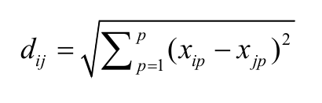
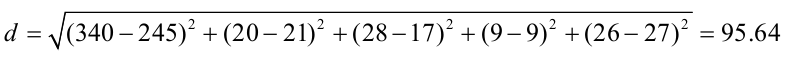

# 聚类分析
**聚类分析**是一种数据归约技术,旨在揭露一个数据集中观测值的子集。它可以把大量的观测值归约为若干个类。这里的类被定义为若干个观测值组成的群组,群组内观测值的相似度比群间相似度高。这不是一个精确的定义,从而导致了各种聚类方法的出现。

聚类分析被广泛用于生物和行为科学、市场以及医学研究中。例如,一名心理学研究员可能基于抑郁症病人的症状和人口统计学数据对病人进行聚类,试图得出抑郁症的亚型,以期通过亚型来找到更加有针对性和有效的治疗方法,同时更好地了解这种疾病。营销研究人员根据消费者的人口统计特征与购买行为的相似性制定客户细分战略,并基于此对其中的一个或多个子组制定
相应的营销战略。医学研究人员通过对DNA微阵列数据进行聚类分析来获得基因表达模式,从而帮助他们理解人类的正常发育以及导致许多疾病的根本原因。最常用的两种聚类方法是层次聚类(`hierarchical agglomerative clustering`)和划 分聚类(`partitioning clustering`)。在层次聚类中,每一个观测值自成一类,这些类每次两两合并,直到所有的类被聚成一类为止。在划分聚类中,首先指定类的个数K,然后观测值被随机分成K类,再重新形成聚合的类。

这两种方法都对应许多可供选择的聚类算法。对于层次聚类来说,最常用的算法是单联动(single linkage)、全联动(`complete linkage `)、平均联动(`average linkage`)、质心(`centroid`)和Ward方法。对于划分聚类来说,最常用的算法是K均值(`K-means`)和围绕中心点的划分(`PAM`)。每个聚类方法都有它的优点和缺点,我们将在本章讨论。这一章的例子围绕食物和酒。我们对 `flexclust` 包中的营养数据集`nutrient` 作层次聚类,以期回答以下问题。
* 基于五种营养标准的27类鱼、禽、肉的相同点和不同点是什么?
* 是否有一种方法能把这些食物分成若干个有意义的类?

我们再用划分聚类来分析178种意大利葡萄酒样品的13种化学成分。数据在 `rattle` 包的`wine `数据集中。这里要解决的问题如下。
* 这些意大利葡萄酒样品能继续分成更细的组吗?
* 如果能,有多少子组?它们的特征是什么?

事实上,样品中共有三个品种的酒(记为类)。这可以帮助我们评估聚类分析能否辨别这一结构。
尽管聚类方法种类各异,但是它们通常遵循相似的步骤。
##### 1.聚类分析的一般步骤
像因子分析一样,有效的聚类分析是一个多步骤的过程,这其中每一次决策都可能影响聚类结果的质量和有效性。本节介绍一个全面的聚类分析中的11个典型步骤。
(1) 选择合适的变量。第一(并且可能是最重要的)步是选择你感觉可能对识别和理解数据中不同观测值分组有重要影响的变量。例如,在一项抑郁症研究中,你可能会评估以下一个或多个方面:心理学症状,身体症状,发病年龄,发病次数、持续时间和发作时间,住院次数,自理能力,社会和工作经历,当前的年龄,性别,种族,社会经济地位,婚姻状况,家族病史以及对以前治疗的反应。高级的聚类方法也不能弥补聚类变量选不好的问题。
(2) 缩放数据。如果我们在分析中选择的变量变化范围很大,那么该变量对结果的影响也是最大的。这往往是不可取的,分析师往往在分析之前缩放数据。最常用的方法是将每个变量标准化为均值为0和标准差为1的变量。其他的替代方法包括每个变量被其最大值相除或该变量减去它的平均值并除以变量的平均绝对偏差。这三种方法能用下面的代码来解释:
```R
df1 <- apply(mydata, 2, function(x){(x-mean(x))/sd(x)})
df2 <- apply(mydata, 2, function(x){x/max(x)})
df3 <- apply(mydata, 2, function(x){(x – mean(x))/mad(x)})
```
可以使用 `scale()` 函数来将变量标准化到均值为0和标准差为1的变量。这和第
一个代码片段( `df1` )等价。
(3) 寻找异常点。许多聚类方法对于异常值是十分敏感的,它能扭曲我们得到的聚类方案。你可以通过 `outliers` 包中的函数来筛选(和删除)异常单变量离群点。 `mvoutlier` 包中包含了能识别多元变量的离群点的函数。一个替代的方法是使用对异常值稳健的聚类方法,围绕中心点的划分可以很好地解释这种方法。
(4) 计算距离。尽管不同的聚类算法差异很大,但是它们通常需要计算被聚类的实体之间的距离。两个观测值之间最常用的距离量度是欧几里得距离,其他可选的量度包括曼哈顿距离、兰氏距离、非对称二元距离、最大距离和闵可夫斯基距离(可使用 ?dist 查看详细信息)。
(5) 选择聚类算法。接下来选择对数据聚类的方法,层次聚类对于小样本来说很实用(如150个观测值或更少),而且这种情况下嵌套聚类更实用。划分的方法能处理更大的数据量,但是需要事先确定聚类的个数。一旦选定了层次方法或划分方法,就必须选择一个特定的聚类算法。这里再次强调每个算法都有优点和缺点。
(6) 获得一种或多种聚类方法。这一步可以使用步骤(5)选择的方法。
(7) 确定类的数目。为了得到最终的聚类方案,你必须确定类的数目。对此研究者们也提出了很多相应的解决方法。常用方法是尝试不同的类数(比如2~K)并比较解的质量。在 `NbClust`包中的 `NbClust()` 函数提供了30个不同的指标来帮助你进行选择(也表明这个问题有多么难解)。本章将多次使用这个包。
(8) 获得最终的聚类解决方案。一旦类的个数确定下来,就可以提取出子群,形成最终的聚类方案了。
(9) 结果可视化。可视化可以帮助你判定聚类方案的意义和用处。层次聚类的结果通常表示为一个树状图。划分的结果通常利用可视化双变量聚类图来表示。
(10) 解读类。一旦聚类方案确定,你必须解释(或许命名)这个类。一个类中的观测值有何相似之处?不同的类之间的观测值有何不同?这一步通常通过获得类中每个变量的汇总统计来完成。对于连续数据,每一类中变量的均值和中位数会被计算出来。对于混合数据(数据中包含分类变量),结果中将返回各类的众数或类别分布。
(11) 验证结果。验证聚类方案相当于问:“这种划分并不是因为数据集或聚类方法的某种特性,而是确实给出了一个某种程度上有实际意义的结果吗?”如果采用不同的聚类方法或不同的样本,是否会产生相同的类? `fpc` 、 `clv` 和 `clValid` 包包含了评估聚类解的稳定性的函数。

##### 2.计算距离
聚类分析的第一步都是度量样本单元间的距离、相异性或相似性。两个观测值之间的欧几里
得距离定义为:



这里**i**和**j**代表第**i**和第**j**个观测值,**p**是变量的个数。
查看在 `flexclust `包中的营养数据集,它包括对27种肉、鱼和禽的营养物质的测量。最初的几个观测值由下面的代码给出:
```R
> data(nutrient, package="flexclust")
> head(nutrient, 4)
```
数据包加载成功：


前两个观测值( BEEF BRAISED 和 HAMBURGER )之间的欧几里得距离为:



R软件中自带的 `dist()` 函数能用来计算矩阵或数据框中所有行(观测值)之间的距离。格式是 `dist(x, method=)` ,这里的 `x` 表示输入数据,并且默认为欧几里得距离。函数默认返回一个下三角矩阵,但是 `as.matrix()` 函数可使用标准括号符号得到距离。对于营养数据集的数据框来说,前四行的距离为:


观测值之间的距离越大,异质性越大。观测值和它自己之间的距离是0。不出所料, dist()函数计算出的红烧牛肉和汉堡之间的距离与手算一致。
###### **NOTE混合数据类型的聚类分析:**
###### **欧几里得距离通常作为连续型数据的距离度量。但是如果存在其他类型的数据,则需要相异的替代措施,你可以使用 cluster 包中的 daisy() 函数来获得包含任意二元(binary)、名义(nominal)、有序(ordinal)、连续(continuous)属性组合的相异矩阵。 cluster 包中的其他函数可以使用这些异质性来进行聚类分析。例如 agnes() 函数提供了层次聚类, pam() 函数提供了围绕中心点的划分的方法。**

###### 需要注意的是,在营养数据集中,距离很大程度上由能量( energy )这个变量控制,这是因为该变量变化范围更大。缩放数据有利于均衡各变量的影响。

##### 3.层次聚类分析
如前所述,在层次聚类中,起初每一个实例或观测值属于一类。聚类就是每一次把两类聚成新的一类,直到所有的类聚成单个类为止,算法如下:
(1) 定义每个观测值(行或单元)为一类;
(2) 计算每类和其他各类的距离;
(3) 把距离最短的两类合并成一类,这样类的个数就减少一个;
(4) 重复步骤(2)和步骤(3),直到包含所有观测值的类合并成单个的类为止。在层次聚类算法中,主要的区别是它们对类的定义不同(步骤(2))。表16-1给出了五种最常见聚类方法的定义和其中两类之间距离的定义。

|聚类方法| 两类之间的距离定义|
| ------| ------ |
|单联动|一个类中的点和另一个类中的点的最小距离|
|全联动|一个类中的点和另一个类中的点的最大距离|
|平均联动|一个类中的点和另一个类中的点的平均距离(也称作UPGMA,即非加权对组平均)|
|质心|两类中质心(变量均值向量)之间的距离。对单个的观测值来说,质心就是变量的值|
|Ward法|两个类之间所有变量的方差分析的平方和|

单联动聚类方法倾向于发现细长的、雪茄型的类。它也通常展示一种链式的现象,即不相似的观测值分到一类中,因为它们和它们的中间值很相像。

全联动聚类倾向于发现大致相等的直径紧凑类。它对异常值很敏感。平均联提供了以上两种方法的折中。相对来说,它不像链式,而且对异常值没有那么敏感。它倾向于把方差小的类聚合。

Ward法倾向于把有少量观测值的类聚合到一起,并且倾向于产生与观测值个数大致相等的类。它对异常值也是敏感的。质心法是一种很受欢迎的方法,因为其中类距离的定义比较简单、易于理解。相比其他方法,它对异常值不是很敏感。但是它可能不如平均联动法或Ward方法表现得好。

层次聚类方法可以用 hclust() 函数来实现,格式是 hclust(d, method=) ,其中 d 是通过dist() 函 数产生的距离矩阵,并且方法包括"single" 、"complete" 、"average"、"centroid"和"ward" 。

我们的目的是基于27种食物的营养信息辨别其相似性、相异性并分组。下面的代码清单提供了实施聚类的代码。

```R
data(nutrient, package="flexclust")
row.names(nutrient) <- tolower(row.names(nutrient))
nutrient.scaled <- scale(nutrient)
d <- dist(nutrient.scaled)
fit.average <- hclust(d, method="average")
plot(fit.average, hang=-1, cex=.8, main="Average Linkage Clustering")
```

**代码解读：**
首先载入数据,同时将行名改为小写(因为我讨厌大写的标签)。由于变量值的变化范围很大,我们将其标准化为均值为0、方差为1。27种食物之间的距离采用欧几里得距离,应用的方法是平均联动。最后,结果用树状图来展示(参见图16-1)。 plot() 函数中的 hang 命令展示观测值的标签(让它们在挂在0下面)。


树状图应该从下往上读,它展示了这些条目如何被结合成类。每个观测值起初自成一类,然后相距最近的两类(beef braised和smoked ham)合并。其次,pork roast和pork simmered合并,chicken canned和tuna canned合并。再次, beef braised/smoked ham这一类和pork roast/pork simmered这一类合并(这个类目前包含四种食品)。合并继续进行下去,直到所有的观测值合并成一类。高度刻度代表了该高度类之间合并的判定值。对于平均联动来说,标准是一类中的点和其他类中的点的距离平均值。如果你的目的是理解基于食物营养成分的相似性和相异性,图16-1就足够了。它提供了27种食物之间的相似性/异质性的层次分析视图。 tuna canned和chicken canned是相似的,但是都和clamscanned有很大的不同。但是,如果最终目标是这些食品分配到的类(希望有意义的)较少,我们需要额外的分析来选择聚类的适当个数。NbClust 包提供了众多的指数来确定在一个聚类分析里类的最佳数目。不能保证这些指标得出的结果都一致。事实上,它们可能不一样。但是结果可用来作为选择聚类个数K值的一个参考。NbClust() 函数的输入包括需要做聚类的矩阵或是数据框,使用的距离测度和聚类方法,并考虑最小和最大聚类的个数来进行聚类。它返回每一个聚类指数,同时输出建议聚类的最佳数目。下面的代码清单使用该方法处理营养数据的平均联动聚类。

下面的代码将示例选择聚类的个数：

```R
library(NbClust)
devAskNewPage(ask=TRUE)
nc <- NbClust(nutrient.scaled, distance="euclidean",min.nc=2, max.nc=15, method="average")
table(nc$Best.n[1,])
barplot(table(nc$Best.n[1,]),xlab="Numer of Clusters", ylab="Number of Criteria",main="Number of Clusters Chosen by 26 Criteria")
```


## 未完待续...